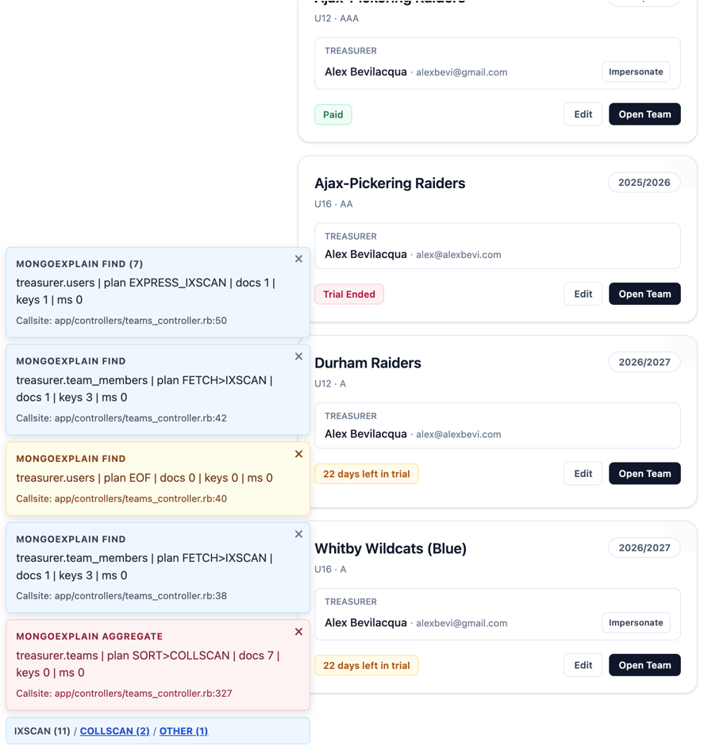
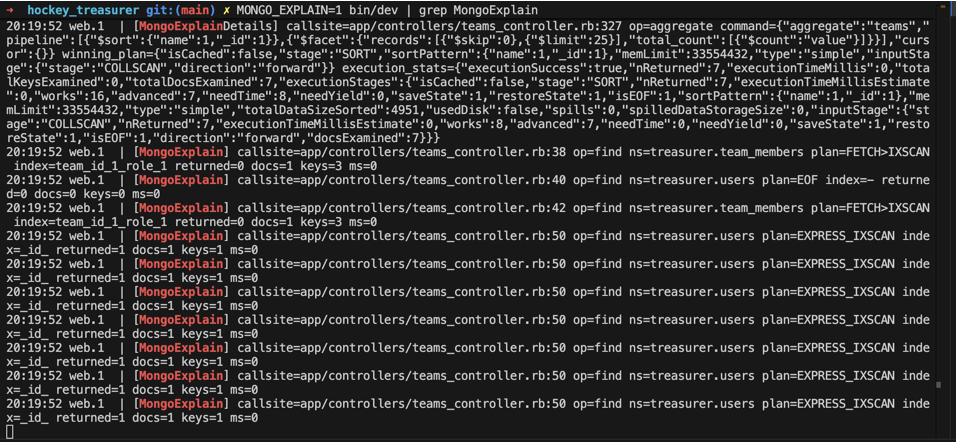

# MongoExplain

MongoExplain helps teams spot expensive MongoDB queries during development.

It combines:
- a low-noise explain monitor that writes structured summary/detail logs
- an optional in-browser ActionCable overlay for live query-plan signals while you click through the app

Core monitoring is usable without Rails. The UI overlay is Rails-engine-only.


## Detailed Use Case

MongoExplain is built for apps where MongoDB queries are generated across many controllers/services and it is hard to see, in context, when query plans regress.

Typical scenarios:
- a list page suddenly feels slower after a filter/sort change
- a query that used to use an index now scans full collections (`COLLSCAN`)
- multiple teams are changing query code and you want a consistent development feedback loop
- you want callsite-level query-plan visibility without opening `explain` manually for every operation

Instead of manually running one-off shell queries, MongoExplain continuously samples supported read commands and gives you:
- **summary logs** for operation + namespace + plan + docs/keys examined + execution time
- **detail logs** (JSON payloads) when plans are high-risk (`COLLSCAN`) or unrecognized (`UNKNOWN`)
- **optional UI cards** in the browser to surface plan problems in the same flow where they occur

## Architecture

Main entrypoint:
- `lib/mongo_explain.rb`

Layers:
- Core monitor: `lib/mongo_explain/development_monitor.rb`
- UI engine + overlay: `lib/mongo_explain/ui/*`

Core monitor responsibilities:
- Subscribes to Mongo command monitoring events
- Watches supported read commands (`find`, `aggregate`, `count`, `distinct`)
- Runs `explain` probes with `executionStats` verbosity
- Emits concise and detailed logs
- Emits normalized UI events when UI is enabled

UI layer responsibilities:
- ActionCable channel + broadcaster
- Overlay event formatting, dedupe/stack behavior, dismissal/TTL behavior
- Engine-driven importmap/assets/helper wiring

## Installation

Use as a local path gem from a host app:

```ruby
# Gemfile
gem "mongo_explain", path: "../mongo_explain"
```

Then install dependencies:

```bash
bundle install
```

## Usage Modes

### Rails Engine Integration (Overlay + Logs)



Use this mode when you want explain visibility directly in your Rails app UI while navigating pages.

1. Ensure the gem is available in your Rails app.
2. Enable UI mode:

```bash
export MONGO_EXPLAIN_UI=1
```

3. Render the overlay partial in your layout:

```erb
<%= render "mongo_explain/ui/overlay" %>
```

Notes:
- UI mode is Rails-only.
- When UI is enabled, the engine also enables `MONGO_EXPLAIN=1` in development.
- Explain probes default to `Mongoid.default_client` when Mongoid is present.
- UI cards are stacked/merged for repeated calls; for example `MongoExplain FIND (7)` means the same call pattern occurred 7 times, which may indicate another optimization opportunity.

### Console-Only / Standalone Library (Logger Output)



Use this mode when you want query-plan monitoring without Rails or without the UI overlay.

Configure a Mongo client provider (required for explain probes in standalone mode):

```ruby
MongoExplain::DevelopmentMonitor.configure do |config|
  config.client_provider = -> { mongo_client } # Mongo::Client-compatible
  # config.logger = Logger.new($stdout)         # optional custom logger
end
```

Enable monitor mode:

```bash
export MONGO_EXPLAIN=1
```

Optional restriction (log only plans containing `COLLSCAN`):

```bash
export MONGO_EXPLAIN_ONLY_COLLSCAN=1
```

## Environment Flags

- `MONGO_EXPLAIN=1`: enable explain monitoring
- `MONGO_EXPLAIN_ONLY_COLLSCAN=1`: limit logs/events to plans containing `COLLSCAN`
- `MONGO_EXPLAIN_UI=1`: enable development overlay
- `MONGO_EXPLAIN_UI_CHANNEL`: override ActionCable channel name (default `mongo_explain:ui`)
- `MONGO_EXPLAIN_UI_MAX_STACK`: max visible overlay cards (default `5`)
- `MONGO_EXPLAIN_UI_TTL_MS`: default card TTL in milliseconds (default `12000`)

## Logging Behavior

MongoExplain prefers `Rails.logger` when Rails is loaded and falls back to a standard Ruby logger on `$stdout` otherwise.

Summary logs include:
- callsite
- operation
- namespace
- plan stage path
- index names
- `nReturned`, docs examined, keys examined, execution ms

Detail logs include JSON payloads for:
- explain target command
- winning plan
- execution stats

Detail logs are emitted when:
- winning plan contains `COLLSCAN`, or
- computed plan path resolves to `UNKNOWN`

## Development

```bash
bundle install
bundle exec rspec
bundle exec rspec spec/lib/mongo_explain/development_monitor_spec.rb
```

## License

MIT. See `LICENSE`.
